# Prophecy Trading Platform

Prophecy is an enterprise-grade options trading, backtesting, and paper execution platform engineered for the Indian derivatives market (NIFTY / BANKNIFTY). It features strict multi-timeframe strategy evaluation across 5 synchronized timeframes, an authoritative mathematical indicator engine, an automated option contract selector, pre-trade risk management with emergency kill switch protection, and a real-time FastAPI + SSE streaming backend.

---

## 🏛️ Architecture Overview

```mermaid
flowchart TB
    subgraph MarketData [Market Data & Broker Layer]
        Groww[Groww API Adapter]
        MockGroww[Mock Groww Adapter]
        Sessions[Indian Market Sessions 09:15-15:30 IST]
        Chain[Option Chain & PCR Calculator]
    end

    subgraph Analytics [Technical Indicator Engine]
        RSI[Wilder RSI 14]
        ADX[ADX 14 & DI+/DI-]
        BB[Bollinger Bands & %B]
        PSAR[Parabolic SAR]
        CK[Chande Kroll Stops]
        MA[EMA Slope & Angle]
        VOL[VWAP & RVOL]
    end

    subgraph Strategy [Strategy Cases & Contract Selector]
        C1[Case 1: Straddle Baseline]
        C2[Case 2: Straddle Special]
        C3[Case 3: Directional Call]
        C4[Case 4: Directional Put]
        C5[Case 5: Call Special]
        C6[Case 6: Put Special]
        Selector[Option Contract & Lot Selector]
    end

    subgraph RiskGate [Authoritative Risk Management]
        RiskMgr[Risk Policy & Loss Limits]
        KillSwitch[Emergency Kill Switch]
        LiveGate[6-Lock Live Safety Gate]
    end

    subgraph Execution [Execution & Routing Layer]
        Router[Confirmation Router]
        PaperBroker[Paper Account & Simulated Ledger]
        Backtester[Backtest Runner & Indian Tariff Costs]
    end

    subgraph BackendAPI [FastAPI & SSE Streaming Backend]
        REST[FastAPI REST Endpoints]
        SSE[Server-Sent Events Real-Time Stream]
    end

    MarketData --> Analytics
    Analytics --> Strategy
    Strategy --> RiskGate
    RiskGate --> Execution
    Execution --> BackendAPI
```



---

## 📋 Milestone Completion Matrix

| Milestone | Area | Status | Deliverables |
|---|---|---|---|
| **M1** | Market Data & Broker Protocols | ✅ Complete | `Timeframe`, `Candle`, `InstrumentMaster`, `OptionChain` (Total & 4-ITM PCR), `GrowwAdapter`, `MockGrowwAdapter` |
| **M2** | Technical Indicators Engine | ✅ Complete | Wilder RSI, ADX, Bollinger Bands, Parabolic SAR, Chande Kroll, EMA slope/angle, VWAP, RVOL |
| **M3** | Strategy Cases Engine | ✅ Complete | Cases 1–6 pure evaluation, 5-timeframe completeness guard, `SignalEngine` orchestrator |
| **M4** | Option Selector | ✅ Complete | ATM/ITM/OTM contract resolution, lot sizes, spread & liquidity filters, 0-DTE expiry rules |
| **M5** | Authoritative Risk Manager | ✅ Complete | State machine, daily loss caps, position limits, symbol session rate limits, emergency kill switch |
| **M6** | Backtester & Analytics | ✅ Complete | Synchronized multi-TF replayer, Indian regulatory tariffs (STT, GST, SEBI), slippage, Markdown reporting |
| **M7** | Paper Execution & Router | ✅ Complete | Simulated cash ledger, weighted average pricing, signal lifecycle routing (`MANUAL_CONFIRMATION`, `AUTO_PAPER`) |
| **M8** | Live Safety Guardrails | ✅ Complete | 6-lock safety gate, multi-key env auth, cryptographic single-use confirmation tokens, size ceilings |
| **M9** | FastAPI Backend & SSE | ✅ Complete | REST endpoints (`/health`, `/signals`, `/orders`, `/positions`, `/kill-switch`, `/backtest`), SSE stream |
| **M10** | System Verification & Docs | ✅ Complete | 100/100 unit & integration tests passing, production runbooks, API contracts, deployment specs |

---

## 🚀 Quickstart & Testing

### 1. Prerequisites
- Python 3.9+ with `uv` package manager

### 2. Run All Automated Test Suites (100 Tests)
```powershell
$env:Path = "C:\Users\Middleware\.local\bin\mingit\cmd;C:\Users\Middleware\.local\bin;$env:Path"

# Run all 93 engine tests
uv run python -m unittest discover -s engine/tests -v

# Run all 7 backend API tests
uv run --with fastapi --with uvicorn --with pydantic --with httpx python -m unittest discover -s backend/app/tests -v
```

### 3. Run Linter & Formatter
```powershell
uv run --with ruff ruff check engine/src engine/tests backend/app
uv run --with ruff ruff format --check engine/src engine/tests backend/app
```

### 4. Start the FastAPI Server
```powershell
$env:PYTHONPATH = "engine/src;backend"
uv run --with fastapi --with uvicorn --with pydantic uvicorn app.main:app --host 0.0.0.0 --port 8000 --reload
```

---

## 🔒 Safety Guarantee

Live execution with real capital is disabled by default and locked behind a strict 6-layer security gate. All development and automated testing runs exclusively in `MANUAL_CONFIRMATION` or `AUTO_PAPER` modes.
