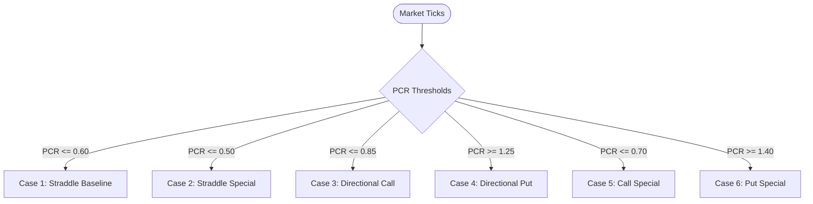

# Prophecy Trading Platform — Strategy Specification & Formulas

This specification formalizes the multi-timeframe indicator rules, Put-Call Ratio (PCR) definitions, and 6 strategy evaluation cases implemented in `prophecy_engine`.

---

## 1. Required Five Timeframes

Every strategy evaluation strictly requires synchronized indicator snapshots across all **5 timeframes**:
- `1m` (Entry Trigger / Momentum Pulse)
- `3m` (Short-term Trend Filter)
- `5m` (Primary Strategy Trend)
- `15m` (Intermediate Trend Confirmation)
- `30m` (Macro Trend / Boundary Context)

If any timeframe is missing or contains `NaN` values, evaluation aborts with `StrategyCompletenessError` to eliminate incomplete-data false triggers.

---

## 2. Put-Call Ratio (PCR) Definitions

### Standard Total PCR
$$\text{PCR}_{\text{total}} = \frac{\sum \text{Open Interest of Put Options}}{\sum \text{Open Interest of Call Options}}$$

### 4-ITM PCR (High-Conviction Institutional Bias)
Calculated using the 4 In-The-Money (ITM) strikes relative to the current underlying ATM strike:
- For CE: 4 strikes directly below ATM ($S_{-1}, S_{-2}, S_{-3}, S_{-4}$)
- For PE: 4 strikes directly above ATM ($S_{+1}, S_{+2}, S_{+3}, S_{+4}$)

$$\text{PCR}_{\text{4-ITM}} = \frac{\sum_{i=1}^4 \text{OI}(\text{PE}_{\text{ITM}, i})}{\sum_{i=1}^4 \text{OI}(\text{CE}_{\text{ITM}, i})}$$

---

## 3. Mathematical Indicator Formulas

| Indicator | Formula / Rule |
|---|---|
| **Wilder RSI (14)** | $\text{RSI} = 100 - \frac{100}{1 + \text{RS}}$, smoothed via $\text{AvgGain}_{t} = \frac{13 \cdot \text{AvgGain}_{t-1} + \text{Gain}_t}{14}$ |
| **ADX (14)** | $\text{DX} = \frac{\lvert +\text{DI} - -\text{DI} \rvert}{+\text{DI} + -\text{DI}} \times 100$, smoothed via Wilder EMA |
| **Bollinger Bands** | $\text{Upper} = \text{SMA}_{20} + 2\sigma, \quad \text{Lower} = \text{SMA}_{20} - 2\sigma, \quad \%B = \frac{\text{Price} - \text{Lower}}{\text{Upper} - \text{Lower}}$ |
| **Parabolic SAR** | $\text{SAR}_{t+1} = \text{SAR}_t + \alpha (\text{EP} - \text{SAR}_t), \quad \alpha \in [0.02, 0.20]$ |
| **Chande Kroll Stop** | High stop based on $P$-period highest high minus $K \times \text{ATR}(P)$ |
| **EMA Slope & Angle** | $\text{Slope} = \frac{\text{EMA}_t - \text{EMA}_{t-k}}{k}, \quad \text{Angle} = \arctan(\text{Slope}) \times \frac{180}{\pi}$ |
| **VWAP & RVOL** | $\text{VWAP} = \frac{\sum (P \cdot V)}{\sum V}, \quad \text{RVOL} = \frac{V_t}{\text{SMA}_{20}(V)}$ |

---

## 4. The 6 Authoritative Strategy Cases

### Case 1: Straddle Baseline (Volatility Squeeze / Range Expansion)
- **PCR Limit**: $\text{PCR} \le 0.60$
- **Timeframes**: `1m`, `3m`, `5m`, `15m`, `30m`
- **Rules**:
  - `15m` RSI between 45 and 55 (Range-bound compression)
  - `5m` Bollinger Bandwidth $< 0.04$ (Squeeze)
  - Price within 0.25% of 5m VWAP
- **Instrument**: Buy ATM Straddle (1 ATM Call + 1 ATM Put).

### Case 2: Straddle Special (High-Volatility Breakout)
- **PCR Limit**: $\text{PCR} \le 0.50$
- **Timeframes**: `1m`, `3m`, `5m`, `15m`, `30m`
- **Rules**:
  - `30m` ADX $> 25.0$ (Strong macro trend readiness)
  - `1m` RVOL $> 2.0$ (Volume surge breakout)
  - `5m` PSAR flip confirmed
- **Instrument**: Buy ATM Straddle with immediate ATR-based trailing stop.

### Case 3: Directional Call (Bullish Momentum Continuation)
- **PCR Limit**: $\text{PCR} \le 0.85$
- **Rules**:
  - `1m`, `3m`, `5m` RSI $> 55.0$
  - `5m` and `15m` EMA(9) $>$ EMA(21) with positive slope angle $> 15^\circ$
  - `5m` Close $>$ VWAP
  - `5m` Parabolic SAR Bullish
- **Instrument**: Buy ATM or ITM-1 Call Option (`CE`).

### Case 4: Directional Put (Bearish Momentum Breakdown)
- **PCR Limit**: $\text{PCR} \ge 1.25$
- **Rules**:
  - `1m`, `3m`, `5m` RSI $< 45.0$
  - `5m` and `15m` EMA(9) $<$ EMA(21) with negative slope angle $< -15^\circ$
  - `5m` Close $<$ VWAP
  - `5m` Parabolic SAR Bearish
- **Instrument**: Buy ATM or ITM-1 Put Option (`PE`).

### Case 5: Call Special (Extreme Trend Reversal / Bullish Exhaustion Flip)
- **PCR Limit**: $\text{PCR} \le 0.70$
- **Rules**:
  - `5m` RSI oversold bounce crossing above 35.0
  - `1m` RVOL $> 2.5$
  - `1m` Close crosses above 1m Chande Kroll Upper Stop
- **Instrument**: Buy ITM-1 Call Option (`CE`).

### Case 6: Put Special (Extreme Overbought Reversal / Bearish Exhaustion Flip)
- **PCR Limit**: $\text{PCR} \ge 1.40$
- **Rules**:
  - `5m` RSI overbought reversal crossing below 65.0
  - `1m` RVOL $> 2.5$
  - `1m` Close crosses below 1m Chande Kroll Lower Stop
- **Instrument**: Buy ITM-1 Put Option (`PE`).
